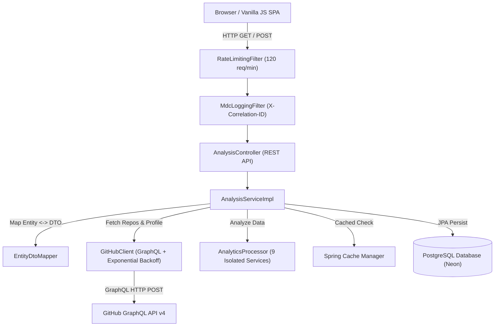
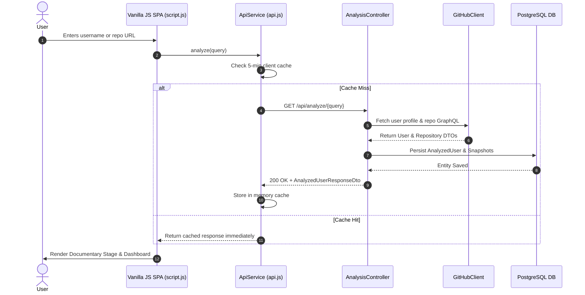

# 🏗️ System Architecture & Design Documentation

> **GitHub Time Machine — System Topology**
> End-to-end structural documentation covering system components, data flow pipelines, package organization, and security boundaries.

---

## 📐 System Architecture Diagram



---

## 🔄 Sequence Diagram: User Analysis Flow



---

## 📦 Package Architecture (Clean Architecture Principles)

```
com.githubtimemachine
├── analytics/           # Dedicated Analytics Engine (Isolated calculation services)
│   ├── CommitStreakAnalyzerService.java
│   ├── DeveloperStatisticsService.java
│   ├── GrowthAnalyzerService.java
│   ├── InactivePeriodDetectionService.java
│   ├── LanguageAnalyzerService.java
│   ├── MilestoneGeneratorService.java
│   ├── RepositoryAnalyzerService.java
│   ├── TimelineGeneratorService.java
│   └── AnalyticsEngineFacadeService.java
├── config/              # Infrastructure Configuration & Filters
│   ├── CacheConfig.java
│   ├── CorsConfig.java
│   ├── MdcLoggingFilter.java
│   ├── OpenApiConfig.java
│   └── RateLimitingFilter.java
├── controller/          # Presentation Layer (REST Endpoints)
│   ├── AiController.java
│   ├── AnalysisController.java
│   └── HealthController.java
├── dto/                 # Data Transfer Objects (Strict boundaries)
│   ├── request/
│   └── response/
├── entity/              # JPA Domain Entities
│   ├── BaseEntity.java
│   ├── AnalyzedUser.java
│   ├── RepositorySnapshot.java
│   └── AnalyticsSnapshot.java
├── exception/           # Centralized Global Exception Handler
├── github/              # GitHub Integration Subsystem
│   ├── client/GitHubClient.java
│   ├── mapper/GitHubMapper.java
│   └── service/GitHubServiceImpl.java
├── mapper/              # Entity to DTO Conversion Component
├── repository/          # Spring Data JPA Persistence Interfaces
└── service/             # Application Core Services & Contracts
```

---

## 🔒 Security Model & Isolation

1. **AI Boundary Isolation**: The AI module accepts **only structured analytics DTOs**. Raw GitHub API payloads are never passed to LLM prompts.
2. **Token Security**: GitHub API tokens are passed via environment variable `GITHUB_API_TOKEN` and never stored in git or exposed to client browsers.
3. **No Field Injection**: All Spring components use strict constructor injection, guaranteeing immutability and testability.
