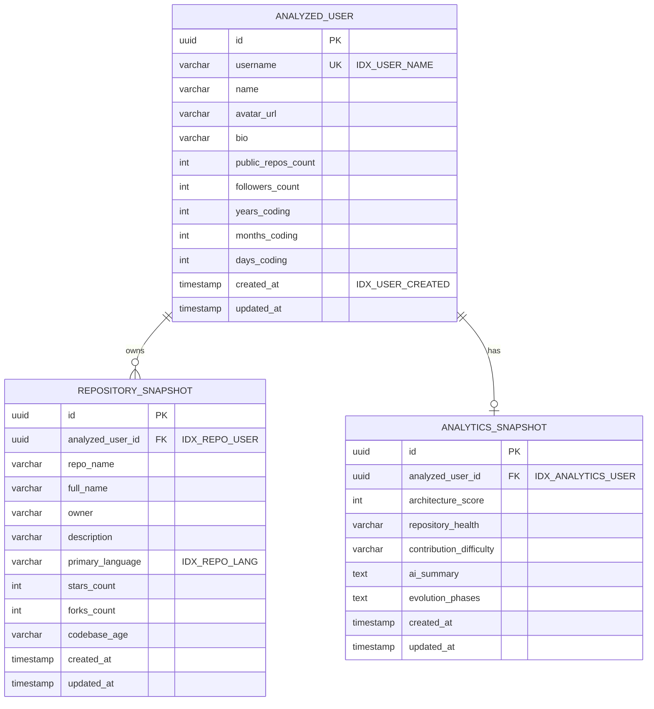

# 🗄️ Database Schema & Entity Documentation

> **GitHub Time Machine — Data Model (PostgreSQL / Neon)**
> Relational schema design, entity relationship diagrams (ERD), indexes, and auditing definitions.

---

## 📊 Entity Relationship Diagram (ERD)

---

## 📋 Table Definitions & Column Details

### 1. `analyzed_user` Table
Stores basic developer profiles and cumulative coding age statistics.

| Column Name | Type | Constraints | Index | Description |
| :--- | :--- | :--- | :--- | :--- |
| `id` | `UUID` | Primary Key | — | Random UUID generated via Java `@GeneratedValue`. |
| `username` | `VARCHAR(255)` | NOT NULL, UNIQUE | `idx_user_name` | Unique GitHub handle. |
| `name` | `VARCHAR(255)` | Nullable | — | Full display name. |
| `avatar_url` | `VARCHAR(512)` | Nullable | — | URL to GitHub avatar image. |
| `bio` | `VARCHAR(1000)` | Nullable | — | User bio text. |
| `public_repos_count` | `INTEGER` | Default 0 | — | Total indexed public repositories. |
| `followers_count` | `INTEGER` | Default 0 | — | Total follower network count. |
| `years_coding` | `INTEGER` | Default 0 | — | Calculated coding age (years). |
| `months_coding` | `INTEGER` | Default 0 | — | Calculated coding age (months). |
| `days_coding` | `INTEGER` | Default 0 | — | Calculated coding age (days). |
| `created_at` | `TIMESTAMP` | NOT NULL | `idx_user_created` | JPA Auditing creation timestamp. |
| `updated_at` | `TIMESTAMP` | NOT NULL | — | JPA Auditing last modification timestamp. |

---

### 2. `repository_snapshot` Table
Stores snapshots of public repositories associated with an analyzed user.

| Column Name | Type | Constraints | Index | Description |
| :--- | :--- | :--- | :--- | :--- |
| `id` | `UUID` | Primary Key | — | Primary Key UUID. |
| `analyzed_user_id` | `UUID` | Foreign Key | `idx_repo_user` | Reference to `analyzed_user(id)`. |
| `repo_name` | `VARCHAR(255)` | NOT NULL | — | Short repository name. |
| `full_name` | `VARCHAR(255)` | NOT NULL | — | Full name (`owner/repo`). |
| `owner` | `VARCHAR(255)` | NOT NULL | — | Repository owner. |
| `description` | `VARCHAR(1000)`| Nullable | — | Repository description. |
| `primary_language` | `VARCHAR(100)` | Nullable | `idx_repo_lang` | Dominant primary programming language. |
| `stars_count` | `INTEGER` | Default 0 | — | Stargazer count. |
| `forks_count` | `INTEGER` | Default 0 | — | Fork count. |
| `codebase_age` | `VARCHAR(100)` | Nullable | — | Codebase age string (e.g. "11 Years"). |

---

### 3. `analytics_snapshot` Table
Stores calculated metrics, architecture scores, and AI evolutionary summaries.

| Column Name | Type | Constraints | Index | Description |
| :--- | :--- | :--- | :--- | :--- |
| `id` | `UUID` | Primary Key | — | Primary Key UUID. |
| `analyzed_user_id` | `UUID` | Foreign Key | `idx_analytics_user` | Reference to `analyzed_user(id)`. |
| `architecture_score`| `INTEGER` | Default 0 | — | Computed architecture score (0-100). |
| `repository_health`| `VARCHAR(255)` | Nullable | — | Repository health rating. |
| `contribution_difficulty`| `VARCHAR(255)`| Nullable | — | Contribution difficulty rating. |
| `ai_summary` | `TEXT` | Nullable | — | AI generated system summary. |
| `evolution_phases` | `TEXT` | Nullable | — | AI generated evolution milestones. |
